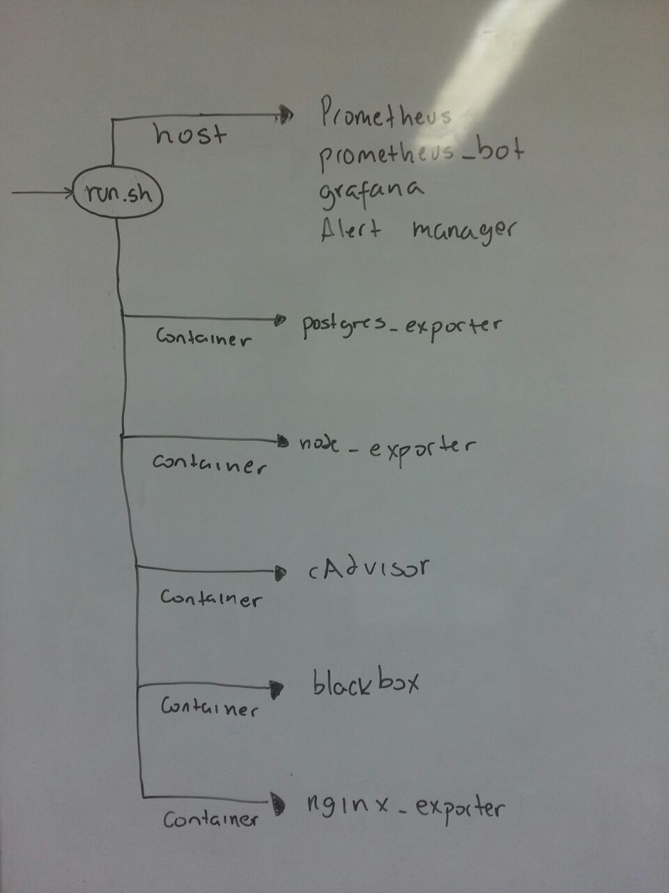

#NicAlarming
 A monitoring solution for NicLabs projets with [Prometheus](https://github.com/prometheus/prometheus), [Grafana](https://github.com/grafana/grafana), [cAdvisor](https://github.com/google/cadvisor), [NodeExporter](https://github.com/prometheus/node_exporter), [PostgresExporter](https://github.com/wrouesnel/postgres_exporter), [NginxExporter](https://github.com/discordianfish/nginx_exporter), [Blackbox](https://github.com/prometheus/blackbox_exporter) and alerting with [AlertManager](https://github.com/prometheus/alertmanager), [Bot Telegram](https://github.com/inCaller/prometheus_bot).

## Deploy Instructions

Cloning repositories:

1. Create a folder "Prometheus"


2. Prometheus

	```shell
	$ cd Prometheus
	$ git clone https://github.com/prometheus/prometheus
	```
3. AlertManager

	```shell
	$ cd Prometheus
	$ git clone https://github.com/prometheus/alertmanager
	```
4. Prometheus bot

	```shell
	$ cd Prometheus
	$ git clone https://github.com/inCaller/prometheus_bot
	```	

5. Grafana
	
	```shell
	# Download and unpack Grafana from binary tar (adjust version as appropriate).
	$ cd Prometheus
	$ curl -L -O https://grafanarel.s3.amazonaws.com/builds/grafana-2.5.0.linux-x64.tar.gz
 	$ tar zxf grafana-2.5.0.linux-x64.tar.gz
 	```

6. NicAlarming

	```shell
	$ git clone https://github.com/cdotte/NicAlarming.git
	```	

7. Copy all files of NicAlarming folder and paste into Prometheus (Yes to replace all files that already exists)


### Dependencies

	- [GO](https://golang.org/)

	- [Docker](https://www.docker.com/)

	- You have to install with `sudo go get $dependencies` where $dependencies:

		github.com/gin-gonic/gin
		github.com/gin-gonic/gin/binding
		github.com/go-telegram-bot-api/telegram-bot-api 
		gopkg.in/yaml.v2

### To deploy NicAlarming:

1. Edit `run.sh`, in the file: 

	Edit variable "GO" with yout GO path directory

	Edit variable PostgresURL: edit the database name, the user, the password, hostname and the port with our values. For more info you can visit the link above (PostgresExporter). 

	Edit NginxURI with your Nginx status page [here more information](https://nginx.org/en/docs/http/ngx_http_stub_status_module.html)


2. To configure bot to alert with telegram:

	Edit `prometheus_bot/config.yaml` with the token of your telegram bot.

	Edit `alertmanager/config.yaml` chatID with the ChatID of your group in telegram.

	Add grafana dashboards link to your telegram group to quickly visit if something goes wrong.

3. Edit `prometheus/prometheus.yml` scrape_configs with your ip adresses (I recommend check out the ip adress of the containers using `docker inspect --format '{{ .NetworkSettings.IPAddress }}' container_name_or_id` and local ip adress) or edit run.sh to link your containers.

4. Edit `blackbox_exporter/blackbox.yml` with your end-points to monitoring and edit prometheus config file. [here more information](https://github.com/prometheus/blackbox_exporter)

5. Start the monitoring solution with

  ```shell
  $ sudo ./run.sh start
  ```


## Content

### run.sh
Bash script to  start, restart, remove, upgrade and stop the application. The usage is:

```bash
# To start, restart, stop, delete, upgrade
$ ./run.sh start | restart | stop | delete | upgrade

```

### Dashboards

You have to import in grafana all dashboards available in a folder "dashboards". Below there is more information.

Thanks to [dackprom](https://github.com/stefanprodan/dockprom) for the darshboards to Grafana's imports. 

### Others

1. If you want to create others rules for alarming. You have to visit [this](https://prometheus.io/docs/alerting/rules/)

2. If you want to change existing rules for alarming. You have to change the next files `prometheus/host.rules`, `prometheus/targets.rules`, `prometheus/postgres.rules`, `prometheus/containers.rules`, `prometheus/host.rules`. 

3. If you want to see Dashboards (Grafana) in a specific range of time. You have to visit [this](http://docs.grafana.org/reference/timerange/)


### Logic of NicAlarming


